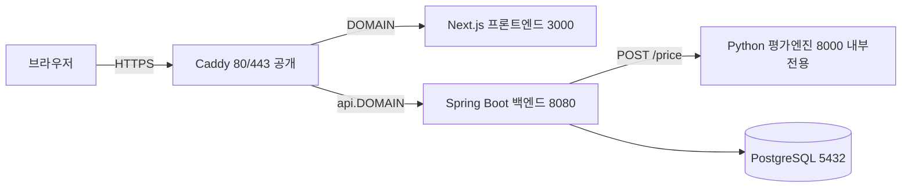

# FairValue Engine

**복합금융상품(CB·EB·BW·RCPS·CPS)의 공정가치 평가를 입력 → 평가 → 계산근거 → 감사대응 보고서까지 자동화한 웹 플랫폼.**

> _A web platform that automates fair-value measurement of complex financial instruments (convertible/exchangeable bonds, warrants, redeemable/convertible preferred shares) end-to-end — from schema-driven input to lattice pricing, transparent calculation trails, and audit-ready reports._


> 🔗 **라이브 데모**: {{DEMO_URL}} · **데모 계정**: {{DEMO_ACCOUNT}}
>
> 회계·금융 도메인 지식을 가진 실무자가 **스펙 주도 AI 협업**으로 설계·구현한 프로젝트입니다. 아래 [검증 체계](#5-검증-체계)가 이 저장소의 핵심입니다.

## 미리보기

> 스크린샷은 데모 촬영 후 `docs/images/`에 추가 예정.

| 화면 | 담는 내용 |
|---|---|
| 상품 입력 폼 | 상품 유형별 스키마로 렌더링되는 입력 폼 |
| 평가 결과 | 총공정가치·단위당·12개 구성요소 분해 |
| 계산근거 | 가격 트리·위험중립확률·이자율표·민감도 3×3 |
| 보고서 PDF | 감사대응 평가보고서(+ 계산근거 엑셀) |
| 대시보드 | 등록 상품·평가·보고서·파라미터 현황 |

<!--  -->
<!--  -->
<!--  -->
<!--  -->
<!--  -->

---

## 1. 왜 만들었나

복합금융상품(전환사채·상환전환우선주 등)의 공정가치 평가는 여전히 담당자별 스프레드시트로 이뤄지는 경우가 많다. 스프레드시트는 (1) **재현이 어렵고**(같은 입력의 재계산 보장이 없음), (2) **계산근거 추적이 단절**되며(중간 격자·확률·이자율이 셀에 묻힘), (3) **감사 대응 시 입력 스냅샷·산출 근거를 사후 재구성**해야 한다. FairValue Engine은 이 세 한계를 겨냥해, 입력을 계약으로 표준화하고 계산 전 과정을 근거로 남기며 감사 추적을 설계 단계에서 내장한 평가 플랫폼이다.

## 2. 핵심 기능

- **스키마 주도 입력 폼** — 상품 유형별 폼을 JSON 스키마로 정의(7종 스키마: RCPS·CPS·CB·EB·BW·SO·CSO). 폼·검증·계약이 단일 출처에서 파생.
- **모형 선택 평가** — 동일 상품을 **Tsiveriotis-Fernandes(T&F)** 와 **Goldman-Sachs(GS)** 두 모형으로 평가(엔진 구현 5종: CB·RCPS·CPS·EB·BW).
- **파라미터 관리** — 수익률 커브 부트스트래핑(YTM → Spot → Forward)과 역사적 변동성 산출·등록, 버전 이력 보존.
- **계산근거(감사근거)** — 가격 트리·위험중립확률·이자율 산정표·민감도 3×3을 결과와 함께 노출.
- **보고서 발급** — 평가보고서 **PDF**(OpenPDF, 한글 폰트 임베딩) + **계산근거 엑셀**(Apache POI) 생성·다운로드.
- **감사 추적** — `input_hash`(SHA-256 정규화)와 평가시점 입력 스냅샷으로 입력 → 근거 → 보고서를 연결.
- **이력·대시보드** — 평가 이력 필터·삭제(감사가치 기준 3계층), 조직 현황 요약.
- **KOFIA 엑셀 파싱** — 평가사 제공 금리 엑셀을 업로드해 커브 후보로 파싱·검토.
- **조직·권한(RBAC)** — 조직 격리 + 역할(ORG_ADMIN·CURVE_MANAGER·VALUATOR·AUDITOR·VIEWER)별 접근제어, JWT 인증.
- **평가 캐시** — 동일 입력(`input_hash`)의 재평가 시 기존 결과를 재사용.

## 3. 시스템 구성



외부로 공개되는 지점은 **Caddy 하나(80/443)** 뿐이며, 프론트·백엔드·엔진·DB는 컨테이너 내부 네트워크 전용이다. 특히 평가엔진은 무인증이므로 절대 외부에 노출하지 않는다.

**3계층 분리 이유**: 평가 로직(순수 계산)을 인증·영속과 분리해, 엔진은 언어·프레임워크 독립적으로 교체·검증 가능하고, 백엔드는 도메인 규칙·감사·권한에 집중한다.

**3대 계약**(additive 확장 원칙 — 필드 추가만, 기존 계약 파괴 금지):

| 계약 | 역할 | 위치 |
|---|---|---|
| **Form Schema** | 상품별 입력 폼 정의 | `shared/schemas/form-schema.ts`, `frontend/src/forms/productSchemas/*.json` |
| **ValuationContext** | 평가 입력 정규화 결과(엔진 입력) | `shared/schemas/valuation-context.schema.json` |
| **PricingResult** | 엔진 산출 결과(12 구성요소·근거·재현정보) | `shared/schemas/pricing-result.schema.json` |

**평가 1회의 여정**: 폼 입력 → 백엔드가 커브·변동성을 매핑해 ValuationContext로 정규화 → `input_hash` 산출·캐시 조회 → 엔진 `POST /price` 호출 → PricingResult(트리·근거 포함) **원문 보존** 저장 → 화면에 결과·계산근거 노출 → 보고서(PDF·Excel) 발급. 이 경로가 곧 감사 추적의 골격이 된다.

## 4. 평가 엔진

CRR 이항격자(`u = exp(σ√Δt)`, `d = 1/u`)를 공통 골격으로, 두 할인 모형을 구현한다.

- **T&F (Tsiveriotis-Fernandes, 1998)** — 상품을 지분요소(전환 시 주식가치, 무위험이자율 `rf`로 할인)와 부채요소(현금 원리금, 위험조정이자율 `rd`로 할인)로 분리해 backward induction. 각 노드에서 보유자의 전환·상환청구권, 발행자의 콜을 최적행사로 반영.
- **GS (Goldman-Sachs, 1994)** — 요소를 분리하지 않고 각 노드의 전환확률 `q`를 전파하며 위험조정할인율 `y = q·rf + (1−q)·rd`로 단일 트리 할인. 신용위험이 전환확률에 연동된다.

**부트스트래핑** — 업로드된 파(par) 커브를 YTM → Spot → Forward로 변환해 스텝별 할인율에 사용. **민감도** — 변동성 × 기초자산 3×3 그리드. **telescoping 12키** — 결과는 `bond_value`·`conversion_option_value`·… 12개 구성요소로 분해되며 **Σ(구성요소) = total_fair_value** 불변식을 만족한다. **steps 이원화** — 계산 정밀도용 스텝과 보고서 표시용 스텝을 분리해, 근거 표는 가독 가능한 노드 수로 축약하되 값은 전체 스텝 계산치를 따른다.

## 5. 검증 체계

> 이 저장소에서 가장 중요한 부분. 모든 수치는 코드·테스트에서 확인 가능한 실측값이다.

평가 엔진의 정확성은 단일 지표로 증명되지 않으므로 세 방향에서 교차 검증한다. **외부 앵커**(실제 상용 보고서와의 총액 대조)로 절대 수준을, **수학적 항등식**(두 모형이 극한에서 서로 붕괴하는 지점)으로 구현 정합을, **메커니즘 게이트**(가정을 켜고 끌 때 결과가 예측대로 반응하는지)로 인과를 확인한다. 결과가 기대와 다를 때는 임의로 맞추지 않고, 그 차이가 버그인지 모형 특성인지 원인을 규명하는 것을 원칙으로 삼았다.

| 층위 | 검증 내용 | 결과 |
|---|---|---|
| **외부 앵커** | RCPS 동일 상품을 **3개 평가시점(2022·2023·2024)** 에 대해 외부 상용 평가보고서 총액과 대조 | 총액 오차 **−0.4% / +2.0% / +0.7%** — ±2% BLOCKING 게이트 통과 |
| **수학적 항등식** | `rd = rf` ⇒ GS ≡ T&F, 전환 off ⇒ 순수채권(@rd) 동치 | 완전 일치 **< 1e-6** (전 옵션 조합) |
| **불변식** | 12개 구성요소 telescoping 합 = 총공정가치, 파생요소 부호 규칙 | Σ = total (≤ 0.01), 부호 규칙 통과 |
| **메커니즘 게이트** | 풋 off ⇒ GS↔T&F 격차 한 자릿수 %로 붕괴 · `rd` 스윕 ⇒ `rd=rf`서 격차 ≈ 0, 스프레드 단조 증가 | 할인 채널 실증 (BLOCKING) |
| **모형차 실증** | 동일 상품 T&F vs GS 격차가 풋 근접도와 동행 | **+4.6% → +12.3% → +13.1%** (원인: 풋-현금 채널 × 고스프레드 B-) |
| **재현성** | `input_hash`(SHA-256 정규화)·`seed` 고정 ⇒ 동일 입력 동일 결과 | Python ↔ Kotlin 해시 교차검증 |
| **자동화 테스트** | 엔진 pytest **82**, 백엔드 **101**(@Test), 프론트 vitest **16** + `tsc`·OpenAPI 린트 | GitHub Actions CI |

**모형차에 대한 입장**: GS와 T&F의 격차(최대 +13.1%)는 버그가 아니라 **문서화된 구조적 모형차**로 판정했다. 근거는 항등식(1e-6)이 통과하므로 극한 정합이 보장된다는 점, 그리고 풋을 끄면 격차가 붕괴한다는 메커니즘 실증이다. 격차의 원인은 GS의 혼합할인 `y = q·rf+(1−q)·rd`가 현금 leg를 T&F 대비 전환확률만큼 가볍게(rf 쪽으로) 할인하기 때문이며, B- 등급의 높은 신용스프레드에서 증폭된다. 억지로 밴드에 맞추지 않고 원인을 규명한 뒤 게이트를 "메커니즘"으로 재설계했다.

**CI(GitHub Actions)** — 매 푸시마다 엔진 pytest, 백엔드 Gradle 테스트(Testcontainers PostgreSQL로 실제 DB 통합), 프론트 `verify:all`(vitest · `tsc` 타입체크 · OpenAPI 린트)을 실행한다.

## 6. 감사 추적성 설계

| 요소 | 내용 |
|---|---|
| **input_hash 체인** | 정규화된 ValuationContext를 SHA-256으로 해싱 → 입력 스냅샷·계산근거·보고서 식별정보를 하나의 해시로 연결(Python 정본과 Kotlin 구현을 테스트 벡터로 교차검증) |
| **평가시점 스냅샷** | 평가 실행 시 입력 전체를 `context_json`(V6)으로 저장 → 이후 파라미터가 바뀌거나 삭제돼도 과거 평가의 재현성·근거가 보존됨 |
| **삭제 3계층** | 감사가치 기준 분기 — 상품(결과 있으면 soft/없으면 hard), 이력(DONE은 숨김·FAILED는 완전삭제), 파라미터(단순 hard — 과거 평가는 스냅샷으로 보존되어 안전) |

## 7. 기술 스택

| 계층 | 기술 |
|---|---|
| 프론트엔드 | Next.js 14.2 (App Router), TypeScript 5.5, Tailwind CSS, TanStack Query |
| 백엔드 | Kotlin 1.9.24, Spring Boot 3.3.2 (Web·Security·Data JPA), JDK 21, JWT, Flyway |
| 평가엔진 | Python 3.12, FastAPI, Pydantic 2 (순수 Python 격자 — 외부 수치 라이브러리 미사용) |
| 데이터 | PostgreSQL 16 |
| 보고서 | OpenPDF(PDF), Apache POI(Excel) |
| 인프라 | Docker Compose, Caddy 2 (자동 HTTPS) |

**DB 마이그레이션 연대기**(Flyway V1~V8 — 개발 서사이자 스키마 진화):

| 버전 | 내용 |
|---|---|
| V1 | 조직·사용자·상품·프로젝트 스키마 + enum(instrument_type/status, user_role) |
| V2 | `pricing_jobs` — 평가 결과(input_hash·seed·status·result_json) |
| V3 | `input_hash` 컬럼 타입 정정(VARCHAR) |
| V4 | `yield_curve_uploads` + `yield_curve_points` — 커브 업로드·버전 이력 |
| V5 | `volatility_data` — 변동성 등록(산출 근거 detail_json) |
| V6 | `pricing_jobs.context_json` — 평가시점 입력 스냅샷(감사 추적) |
| V7 | `pricing_jobs.hidden_at` — 이력 숨김(soft delete) |
| V8 | `valuation_reports` — 발급 보고서(PDF/Excel blob·report_no) |

백엔드는 약 36개 REST 엔드포인트를 제공하며, 계약은 `backend/src/main/resources/openapi.yaml`(OpenAPI 3.1)에 명세된다.

| 도메인 | 주요 엔드포인트 |
|---|---|
| 인증 | `POST /auth/signup`·`/auth/login`, `GET /me` |
| 상품·계약 | `GET`·`POST /instruments`, `PUT /instruments/{id}/terms`, `POST /instruments/{id}/price`, `DELETE /instruments/{id}` |
| 커브 | `POST /curves`(JSON·CSV)·`/curves/parse-kofia`, `GET /curves`·`/curves/{id}`, `DELETE /curves/{id}` |
| 변동성 | `POST /volatilities`·`/volatilities/compute`, `GET`·`DELETE /volatilities/{id}` |
| 평가 이력 | `GET /jobs`, `GET /jobs/{id}/result`·`/context`, `POST /jobs/batch-delete` |
| 보고서 | `POST /jobs/{id}/report`, `GET /reports`, `GET /reports/{id}/pdf`·`/excel` |
| 대시보드·관리 | `GET /dashboard/summary`, `GET /admin/users`, `PATCH /admin/users/{id}` |

### 저장소 구조

```text
fairvalue-engine/
├── pricing-engine/                 # Python 평가엔진 (FastAPI)
│   ├── app/                        #   격자·모형(T&F·GS)·registry·result
│   └── tests/                      #   pytest (82)
├── backend/                        # Kotlin / Spring Boot
│   └── src/main/kotlin/com/fairvalue/
│       ├── web/                    #   REST 컨트롤러
│       ├── service/                #   도메인 서비스·보고서(PDF·Excel) 생성
│       ├── pricing/                #   엔진 클라이언트·컨텍스트 resolve
│       ├── domain·repository·security·contracts/
│       └── resources/db/migration/ #   Flyway V1~V8
├── frontend/                       # Next.js (App Router)
│   └── src/{app,components,forms,lib}/
├── shared/schemas/                 # 3대 계약(단일 출처)
├── golden-values/                  # 검증용 골든·외부 앵커 케이스
├── docker-compose.yml · Caddyfile  # 배포 오케스트레이션
└── README-DEPLOY.md                # 서버 배포 전 과정
```

## 8. 실행 방법

**(a) 개발 모드 — 4프로세스**

```bash
# DB
docker compose -f backend/docker-compose.yml up -d db
# 평가엔진
cd pricing-engine && uvicorn app.main:app --port 8000
# 백엔드
cd backend && ./gradlew bootRun
# 프론트엔드
cd frontend && npm run dev
```

**(b) Docker Compose — 원커맨드(로컬 리허설)**

```bash
cp .env.example .env      # 값 채우기(JWT_SECRET 등)
docker compose -f docker-compose.yml -f docker-compose.local.yml up -d --build
# → http://localhost:3000
```

서버 배포(단일 VPS·Caddy 자동 HTTPS·sslip.io) 전 과정은 **[README-DEPLOY.md](./README-DEPLOY.md)** 참고.

## 9. 개발 방법론 — 스펙 주도 AI 협업

각 단계를 **설계 → 승인 → 구현 → 로컬 검증 → 커밋**의 고정 루프로 진행했다. 도메인(회계·금융) 판단은 사람이, 구현은 AI가 맡되, 두 가지 원칙을 강제했다.

- **"검증 없이 커밋 금지"** — 예: 엔진 응답 원문(가격트리·부트스트래핑·민감도)이 타입 DTO 역직렬화 과정에서 조용히 소실되던 결함을, 커밋 전 검증에서 발견해 원문 보존 구조(`PricingOutcome{raw, result}`)로 근본 수정했다.
- **"억지 calibration 금지"** — GS↔T&F 격차를 임의 파라미터로 밴드에 맞추는 대신, 원인(풋-현금 채널 × 고스프레드)을 규명하고 검증 게이트를 결과 밴드가 아닌 메커니즘(항등식·풋off 붕괴·스프레드 단조)으로 재설계했다.

## 10. 로드맵

- **금리 모형 확장** — BDT·Hull-White 등 단기금리 모형(적용 권장 조건 안내 포함 예정).
- **LSMC 리픽싱** — 경로의존적 전환가 조정(refixing)의 몬테카를로 최소자승 처리.
- **SO/CSO 엔진** — 현재 입력 스키마만 존재하는 주식매수선택권·조건부 SO의 평가 엔진 구현.

## 11. 한계 및 고지

- 본 저장소는 **포트폴리오·데모 목적**이며 실서비스가 아니다. 데모 환경의 데이터는 예고 없이 초기화될 수 있다.
- 평가 결과는 선택한 **모형과 입력 가정에 의존**하며, 특정 목적에 대한 적합성을 보증하지 않는다.
- 외부 앵커 검증은 확보 가능한 상용 평가보고서 사례에 한정되며, 엔진 정밀 검증은 추가 사례 확보 시 지속한다.
- 데모에 게시하는 커브·변동성은 실제 시장데이터가 아닌 **샘플 합성값**을 사용한다.

---

<sub>본 문서의 모든 수치·기능 서술은 저장소 코드·테스트에서 확인 가능한 사실에 기반한다.</sub>
