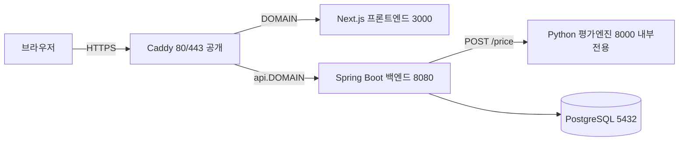
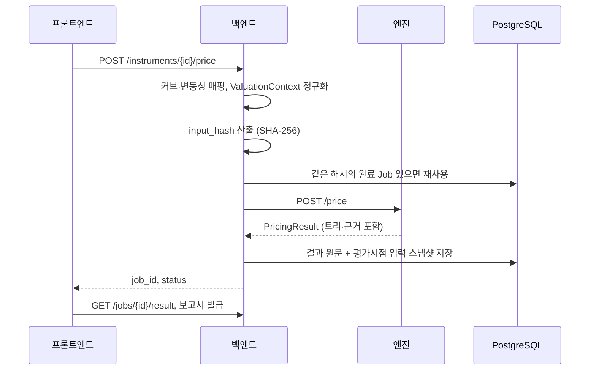
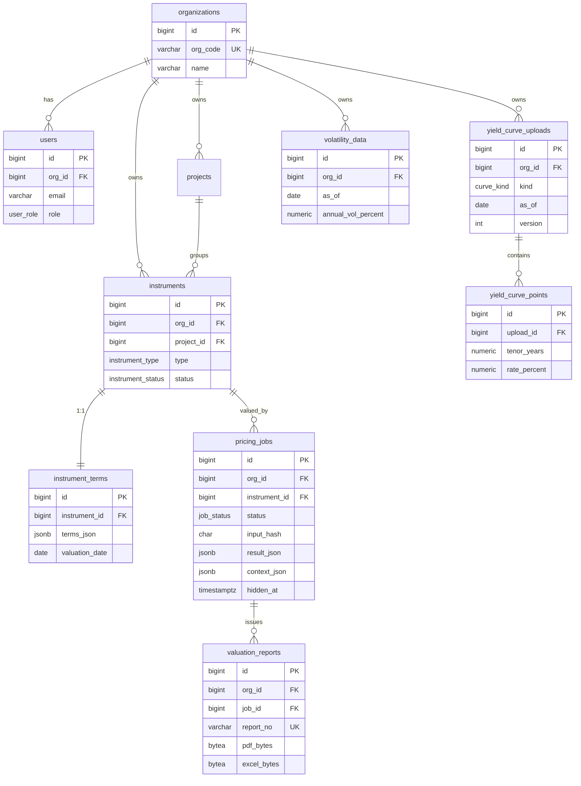

# FairValue Engine

복합금융상품(전환사채·교환사채·신주인수권부사채·상환전환우선주 등)의 공정가치를 평가하고, 계산 근거와 감사대응 보고서까지 자동으로 만들어 주는 웹 플랫폼입니다.

> _Fair-value measurement for complex financial instruments — schema-driven input, lattice pricing, transparent calculation trails, and audit-ready reports._


> 🔗 데모: {{https://comfinvalue.site}} · 데모 계정: {{test1234@test.com/test1234}}
데모 체험은 회원가입 이후 진행하시면 됩니다.

## 배경

복합금융상품 평가는 아직도 담당자 스프레드시트로 이뤄지는 경우가 많습니다. 그래서 같은 입력을 다시 계산했을 때 값이 재현되는지, 중간 근거는 어디에 남는지, 감사 때 입력과 산출을 어떻게 되짚을지가 늘 문제였습니다. 재현성·추적성·감사대응, 이 세 가지를 처음부터 설계에 넣고 만들었습니다. 회계·금융 지식을 바탕으로 사양을 짜고, 구현을 AI와 협업해 완성했습니다.

## 미리보기

> 스크린샷은 데모 촬영 후 `docs/images/`에 추가할 예정입니다.

| 화면 | 내용 |
|---|---|
| 상품 입력 폼 | 상품 유형별 스키마로 렌더링되는 폼 |
| 평가 결과 | 총공정가치, 단위당, 12개 구성요소 분해 |
| 계산근거 | 가격 트리, 위험중립확률, 이자율표, 민감도 3×3 |
| 보고서 | 평가보고서 PDF + 계산근거 엑셀 |
| 대시보드 | 등록 상품·평가·보고서·파라미터 현황 |

<!--  -->
<!--  -->
<!--  -->
<!--  -->
<!--  -->

## 기능

- 상품별 입력 폼을 JSON 스키마로 정의 (RCPS·CPS·CB·EB·BW·SO·CSO 7종)
- 같은 상품을 T&F, GS 두 모형으로 평가 (엔진 구현은 CB·RCPS·CPS·EB·BW)
- 수익률 커브 부트스트래핑(YTM→Spot→Forward)과 역사적 변동성 관리
- 가격 트리·위험중립확률·이자율표·민감도까지 계산 근거를 전부 노출
- 평가보고서 PDF와 계산근거 엑셀 발급
- input_hash와 평가시점 입력 스냅샷으로 감사 추적
- 조직 격리 + 역할 기반 접근제어(RBAC), JWT 인증

## 소프트웨어 아키텍처

[](https://skillicons.dev)

프론트엔드는 Next.js·TypeScript, 백엔드는 Kotlin·Spring Boot, 평가엔진은 Python·FastAPI, 데이터는 PostgreSQL, 배포는 Docker Compose와 Caddy로 구성했습니다.



밖으로 포트를 여는 것은 Caddy(80/443) 하나뿐이고, 나머지는 컨테이너 내부 네트워크에만 둡니다. 특히 평가엔진은 인증이 없어서 노출하면 누구나 계산 API를 호출할 수 있으므로, 비공개를 최우선 제약으로 잡았습니다.

계층을 셋으로 나눈 이유는 이렇습니다.

① 평가엔진 (Python/FastAPI) — 순수 계산만 합니다. 상태도 DB도 인증도 없이 입력 하나를 받아 결과 하나를 돌려줍니다. 이렇게 떼어 두면 엔진만 따로 검증할 수 있고, 나중에 언어나 수치 라이브러리를 통째로 바꿔도 백엔드는 손댈 필요가 없습니다.

② 백엔드 (Kotlin/Spring Boot) — 도메인 규칙이 모이는 곳입니다. 인증·권한, 조직 격리, 입력 정규화, 커브·변동성 매핑, input_hash 산출, 캐시, 결과·스냅샷 저장, 보고서 생성을 맡습니다. 엔진은 인터페이스(`PricingEngineClient`) 뒤에 둬서 더미와 실엔진을 갈아끼웁니다.

③ 프론트엔드 (Next.js) — 스키마로 폼을 그리고 결과·근거를 보여주는 얇은 층입니다. 상품마다 화면을 새로 짜지 않고 JSON 스키마 하나로 7종 폼을 렌더링합니다.

### 모듈 인터페이스

세 모듈은 아래 세 스키마로만 데이터를 주고받습니다. 필드는 더하되 기존 형태는 깨지 않는 방식(additive)으로만 확장하고, 스키마 원본은 `shared/schemas` 한 곳에 두고 빌드할 때 백엔드와 프론트로 복사해 불일치를 막습니다.

| 스키마 | 역할 |
|---|---|
| Form Schema | 상품별 입력 폼 구조. 프론트가 렌더링하고 백엔드가 룰 검증에 사용 |
| ValuationContext | 정규화된 평가 입력. 백엔드가 만들고 엔진이 받음 |
| PricingResult | 엔진 산출. 12개 구성요소·트리·근거·재현정보 |

### 평가 요청 흐름



이 흐름의 핵심은 두 가지입니다. 하나는 input_hash로, 정규화한 입력 전체를 SHA-256으로 묶어 같은 입력이면 캐시로 재사용하고 동시에 감사 식별자로 씁니다. 다른 하나는 원문 보존으로, 엔진이 준 JSON을 타입으로 좁혀 받지 않고 원문 그대로 저장해 트리·부트스트래핑·민감도 같은 근거가 중간에 잘리지 않게 합니다.

## 데이터 아키텍처



데이터 설계에서 신경 쓴 부분은 이렇습니다.

① 조직 격리 — 주요 테이블 전부에 `org_id`를 두고, 조회·수정을 조직 단위로 스코프합니다. 다른 조직 자원은 접근 자체를 막습니다.

② 스냅샷 — 평가 결과와 평가시점 입력을 `pricing_jobs`의 `result_json`·`context_json`에 통째로 저장합니다. 그래서 나중에 커브·변동성이 바뀌거나 삭제돼도 과거 평가는 그대로 재현됩니다.

③ 감사 이력 — 발급 보고서는 PDF·엑셀 바이트를 `valuation_reports`에 담아 `job_id`로 이어 붙이고, 이력 숨김은 `hidden_at`으로 표시합니다(하드 삭제 대신).

④ 확장 방식 — 스키마는 Flyway V1~V8로 관리하며, 필드·테이블을 더하는 방향으로만 확장했습니다.

## 평가 엔진

CRR 이항격자(`u = exp(σ√Δt)`, `d = 1/u`)를 공통 골격으로 두 모형을 얹었습니다.

T&F(Tsiveriotis-Fernandes)는 상품을 지분요소(전환 시 주식가치, `rf`로 할인)와 부채요소(현금흐름, `rd`로 할인)로 나눠 backward induction 합니다. 각 노드에서 보유자의 전환·상환청구와 발행자의 콜을 최적행사로 반영합니다.

GS(Goldman-Sachs)는 요소를 나누지 않고, 노드마다 전환확률 `q`를 전파하며 `y = q·rf + (1−q)·rd`로 한 트리를 할인합니다.

산출은 12개 구성요소로 쪼개지고 그 합은 항상 총공정가치와 같습니다. 커브 부트스트래핑(par → spot → forward)과 변동성×기초자산 민감도 3×3도 함께 뽑습니다.

## 실행

개발 모드 (프로세스 4개)

```bash
docker compose -f backend/docker-compose.yml up -d db   # DB
cd pricing-engine && uvicorn app.main:app --port 8000   # 엔진
cd backend && ./gradlew bootRun                          # 백엔드
cd frontend && npm run dev                               # 프론트
```

Docker Compose 한 번에 (로컬)

```bash
cp .env.example .env      # JWT_SECRET 등 채우기
docker compose -f docker-compose.yml -f docker-compose.local.yml up -d --build
# http://localhost:3000
```

서버 배포(단일 VPS, Caddy 자동 HTTPS)는 [README-DEPLOY.md](./README-DEPLOY.md)에 정리했습니다.

## 저장소 구조

```text
fairvalue-engine/
├── pricing-engine/     # Python 평가엔진 (FastAPI). 격자·모형·registry·result
├── backend/            # Kotlin/Spring Boot. 컨트롤러·서비스·보고서 생성·엔진 연동
│   └── .../db/migration/   # Flyway V1~V8, openapi.yaml
├── frontend/           # Next.js (App Router)
├── shared/schemas/     # 세 스키마의 단일 출처
├── golden-values/      # 검증용 골든·외부 대조 케이스
├── docs/               # 코드 구조 문서
├── docker-compose.yml  # Caddyfile, README-DEPLOY.md
```

코드가 모듈 단위로 어떻게 나뉘는지는 [docs/ARCHITECTURE.md](./docs/ARCHITECTURE.md)에 정리했습니다. 엔진·백엔드·프론트 개별 문서로 이어집니다.

## 테스트 & 검증

| 대상 | 개수 |
|---|---|
| 엔진 (pytest) | 82 |
| 백엔드 (@Test, Testcontainers PostgreSQL) | 101 |
| 프론트 (vitest) | 16 |

CI(GitHub Actions)가 푸시마다 위 테스트에 타입체크와 OpenAPI 린트까지 돌립니다. 엔진 정확성은 세 방향으로 잡았습니다.

① RCPS 동일 상품과 총액을 대조했습니다. 오차는 −0.4% / +2.0% / +0.7%로 ±2% 안에 들어옵니다.

② `rd = rf`이면 GS와 T&F 결과가 같아야 한다는 항등식을 확인합니다(< 1e-6).

③ input_hash(SHA-256)로 같은 입력이면 같은 결과가 나옵니다. 파이썬 정본과 코틀린 구현을 테스트 벡터로 교차검증합니다.

## 감사 추적

- input_hash 체인 — 정규화한 입력을 SHA-256으로 묶어 입력 스냅샷·계산근거·보고서 식별정보를 잇습니다.
- 평가시점 스냅샷 — 평가할 때 입력 전체를 `context_json`에 저장해, 뒤에 파라미터가 바뀌거나 삭제돼도 과거 평가를 그대로 재현합니다.
- 삭제 정책 — 감사 가치를 기준으로 나눴습니다. 결과가 있는 상품은 보관하고 없으면 지웁니다. 완료된 평가는 숨기고 실패한 것만 삭제합니다. 파라미터는 지워도 과거 평가가 스냅샷으로 남아 안전합니다.

## 만든 방식

설계와 도메인(회계·금융) 판단을 직접 하고 구현을 AI에 맡기는 사양 주도 방식으로 개발했습니다. 기능마다 설계 → 승인 → 구현 → 로컬 검증 → 커밋을 반복했고, 검증을 통과하지 못한 변경은 커밋하지 않는 것을 규칙으로 삼았습니다.

## 로드맵

- 금리모형 확장 (BDT, Hull-White)
- LSMC 기반 리픽싱(경로의존 전환가 조정)
- SO·CSO 평가 엔진 (지금은 입력 스키마만 존재)

## 고지

포트폴리오 데모입니다. 실제 서비스가 아니며 데이터는 예고 없이 초기화될 수 있습니다.
