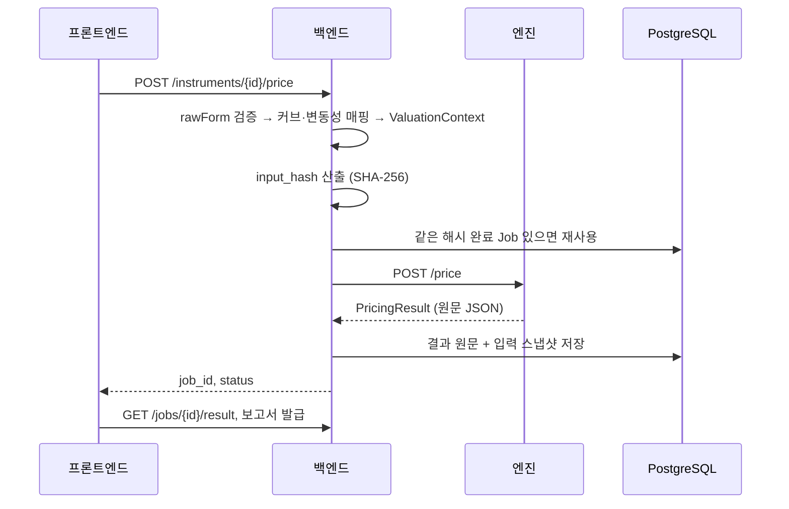

# 코드 구조 안내 (ARCHITECTURE)

이 문서는 저장소 전체의 지도다. 어떤 코드가 어디에 있고 왜 그렇게 나뉘어 있는지를 모듈 단위로 정리했다. 세부는 컴포넌트별 문서로 이어진다.

- [엔진 (Python)](./engine.md) — 순수 계산. 격자·모형·부트스트래핑·민감도.
- [백엔드 (Kotlin/Spring)](./backend.md) — 도메인 규칙·인증·영속·보고서.
- [프론트엔드 (Next.js)](./frontend.md) — 스키마 구동 폼·화면.

전체 개요와 실행 방법은 루트 [README](../README.md), 배포는 [README-DEPLOY](../README-DEPLOY.md)를 본다.

## 큰 그림

세 모듈이 각자 한 가지 책임을 진다.

| 모듈 | 언어 | 책임 | 상태 |
|---|---|---|---|
| pricing-engine | Python / FastAPI | 평가 계산(격자·모형) | 무상태 |
| backend | Kotlin / Spring Boot | 인증·권한·정규화·영속·보고서 | DB 소유 |
| frontend | TypeScript / Next.js | 입력 폼·결과 표시 | 무상태 |

계산을 파이썬으로 떼어 둔 건 백엔드와 독립적으로 검증·교체하기 위해서다. 엔진은 인증도 DB도 없이 `ValuationContext → PricingResult` 변환만 한다. 백엔드는 그 앞에서 도메인 규칙 전부를 책임진다.

## 저장소 레이아웃

```text
fairvalue-engine/
├── pricing-engine/     # 평가엔진 (engine.md)
├── backend/            # 백엔드 (backend.md)
├── frontend/           # 프론트엔드 (frontend.md)
├── shared/schemas/     # 세 계약의 단일 출처
├── golden-values/      # 검증용 골든·외부 대조 케이스
├── docs/               # 이 문서들
├── docker-compose.yml  # 배포 오케스트레이션
├── Caddyfile
└── README-DEPLOY.md
```

## 세 계약

모듈은 세 계약으로만 통신한다. 원본은 `shared/schemas` 한 곳에 두고, 백엔드는 빌드할 때 클래스패스로 복사해 검증에 쓰고, 프론트는 `frontend/src/forms/productSchemas`의 폼 스키마를 그대로 읽는다. 필드는 더하되 기존 계약은 깨지 않는 것(additive)이 규칙이다.

| 계약 | 정의 | 쓰는 곳 |
|---|---|---|
| **Form Schema** | 상품별 입력 폼 구조 | 프론트가 렌더링, 백엔드가 룰 검증 |
| **ValuationContext** | 정규화된 평가 입력 | 백엔드가 만들고 엔진이 받음 |
| **PricingResult** | 엔진 산출(12 구성요소·트리·근거·재현정보) | 엔진이 만들고 백엔드가 저장·표시 |

## 데이터 흐름

평가 한 번의 경로다.



## 곳곳에 걸친 설계 (cross-cutting)

- **input_hash** — 정규화한 입력 전체를 SHA-256으로 묶는다. 캐시 키이자 감사 식별자다. 파이썬(`app/reproducer.py`)과 코틀린(`contracts/InputHash.kt`)에 두 벌 구현이 있고, 테스트 벡터로 서로 같은 해시를 내는지 검증한다.
- **평가시점 스냅샷** — 평가할 때 입력 전체를 Job의 `context_json`에 저장한다(마이그레이션 V6). 뒤에 커브·변동성이 바뀌거나 삭제돼도 과거 평가는 그대로 재현된다.
- **원문 보존(passthrough)** — 엔진 응답을 타입 DTO로 좁혀 받지 않고 원문 JSON을 저장한다. 트리·부트스트래핑·민감도 같은 근거가 중간에 잘리지 않게 하기 위한 것이다.
- **조직 격리** — 거의 모든 조회·수정이 `orgId`로 스코프된다. 다른 조직 자원은 404로 막는다.
- **additive 계약·마이그레이션** — 계약과 DB 스키마(Flyway V1~V8)는 필드/테이블을 더하는 방향으로만 확장한다.

## 배포 토폴로지

`docker-compose.yml`이 다섯 서비스를 띄운다: postgres, engine, backend, frontend, caddy. 밖으로 포트를 여는 건 **caddy(80/443)** 하나뿐이고 나머지는 내부 네트워크 전용이다. 특히 엔진은 인증이 없어 절대 노출하지 않는다. 설정은 `.env`로 주입한다. 자세한 절차는 [README-DEPLOY](../README-DEPLOY.md)에 있다.
